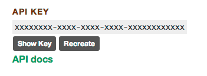

gratitude
=========
[](http://badge.fury.io/rb/gratitude)
[](https://travis-ci.org/JohnKellyFerguson/gratitude)
[](https://gemnasium.com/JohnKellyFerguson/gratitude)
[](https://codeclimate.com/github/JohnKellyFerguson/gratitude)
[](https://coveralls.io/r/JohnKellyFerguson/gratitude)


A simple Ruby wrapper for the [Gittip API](https://github.com/gittip/www.gittip.com#api).

**Note**: This gem is currently under development. A feature complete version that implements all features of the original Gittip API is planned for v0.1.0. Please follow the [Changelog](CHANGELOG.md) to check the status of the project.


# Installation

    gem install gratitude

# Usage

The gratitude gem has four different components that interact with different aspects of the Gittip API. They are as follows:

* [Paydays](#paydays-source-code)
* [Statistics](#statistics)
* [Profile](#profile-source-code)
* [Tips](#tips)

When using gratitude to retrieve data from the Gittip API, please note that many of the JSON key names have been wrapped in more naturally sounding method names. However, all of the original JSON key names have also been maintained as aliases so as to maitain consistency with the original [Gittip API documentation](https://github.com/gittip/www.gittip.com#api).

##Paydays ([source code](https://github.com/JohnKellyFerguson/gratitude/blob/master/lib/gratitude/payday.rb))

The Gittip API provides access to the historical data of all its paydays. To retrieve this information, simply use the following command:

	Gratitude::Payday.all

The above will return an array of Payday objects. Each Payday object responds to the following methods:

* `ach_fees_volume`
* `ach_volume`
* `charge_fees_volume`
* `charge_volume`
* `number_of_ach_credits` (aliases: `nachs` & `number_of_achs` )
* `number_of_active_users` (aliases: `nactive` & `number_active`)
* `number_of_failing_credit_cards` (alias: `ncc_failing`)
* `number_of_missing_credit_cards` (alias: `ncc_missing`)
* `number_of_charges` (alias: `ncharges`)
* `number_of_participants` (alias: `nparticipants`)
* `number_of_tippers` (alias: `ntippers`)
* `number_of_transfers` (alias: `ntransfers`)
* `transfer_volume`
* `transfer_end_time` (alias: `ts_end`)
* `transfer_start_time` (alias: `ts_start`)

You can then iterate through this array of payday objects to persist them to a database or get whatever information you need.

	paydays = Gratitude::Payday.all
	paydays.each do |payday|
	  # get whatever information you want from the payday object
	  # using the above mentioned methods.
	end

Finally, if you just want to get the most recent payday, you can do so by using:

	Gratitude::Payday.most_recent

##Statistics ([source code](https://github.com/JohnKellyFerguson/gratitude/blob/master/lib/gratitude/statistics.rb))
The Statistics aspect of the Gittip API provides the current statistics, as of that moment in time, for Gittip. Note that these stats can potentially change when making subsequent requests.

If you would like to get the current Gittip stats, you can do so by using:

    Gratitude::Statistics.current

Alternatively, you can also use:

    Gratitude::Statistics.new

Each of the above will return an object containing all of the current Gittip stats. You can access each of the Gittip stats using the following methods:

* `average_tip_amount` (alias: `average_tip`)
* `average_number_of_tippees` (alias: `average_tippees`)
* `amount_in_escrow` (alias: `escrow`)
* `last_thursday`
	* This refers to the last Thursday when payments/transfers occured. Possible values include: "last Thursday", "today", "yesterday", and "this past Thursday".
* `number_of_ach_credits` (aliases: `nach` & `number_of_achs`)
* `number_of_active_users` (alias: `nactive`)
* `number_of_credit_cards` (alias: `ncc`)
* `number_of_givers` (alias: `ngivers`)
* `number_who_give_and_receive` (alias: `noverlap`)
* `number_of_receivers` (alias: `nreceivers`)
* `other_people`
	* This returns a string describing how many people the average person on Gittip tips.
* `percentage_of_users_with_credit_cards` (alias: `pcc`)
* `punctuation` (alias: `punc`)
	* This is used internally by the Gittip API for figuring out `last_thursday` and `this_thursday`. It's unlikely that this will need to be utilized by anyone using the gratitude gem.
* `statements`
	* This returns an array of 16 hashes. Each hash provides the personal statement of a Gittip user and has the following keys: `statement`, `username`. Note that this will return a different array of hashes each time you query the Gittip API.
* `this_thursday`
	* This refers to the upcoming Thursday when payments/transfers are set to occur. Possible values include: "this Thursday", "today", "right now!", and "next Thursday"
* `tip_distribution_json`
	* This returns a hash. Each key in the hash is a float which represents a tip amount (for example, $0.01, $0.25 or $1). The value of each key is an array. The first element in the array is an integer representing the total number of users who have pledged that amount. The second element in the array is a float which shows how much this tip amount makes up all of the possible tips. For example, the hash returned will look like the following: `{ 0.01: [11, 0.002153484729835552], … }` 
	
		In this example, the amount being tipped is $0.01. The amount of users tipping this amount is 11, and the total tip amount for this tip size makes up 0.2153484729835552% of all tips distributed. The hash will contain many more elements, each with the same structure.
* `number_of_tips` (alias: `tip_n`)
* `value_of_total_backed_tips` (alias: `total_backed_tips`)
* `transfer_volume`

##Profile ([source code](https://github.com/JohnKellyFerguson/gratitude/blob/master/lib/gratitude/profile.rb))

The Profile aspect of the Gittip API allows you to get the public profile information of any Gittip user. To do so, just pass their username as an initialization argument to the `Gratitude::Profile` class.

	Gratitude::Profile.new("johnkellyferguson")

The above will retrieve the public profile of the above user. You can then access all of the different information with the following methods:

* `avatar_url` (alias: `avatar`)
* `bitbucket_api_url` (alias: `bitbucket`)
  * returns the user's bitbucket api url if they have connected a bitbucket account.
  * otherwise, returns `nil`.
* `bitbucket_username`
  * returns the user's bitbucket username if they have connected a bitbucket account.
  * otherwise, returns `nil`.
* `bountysource_api_url` (alias: `bountysource`)
  * returns the user's bountysource api url if they have connected a bountysource account.
  * otherwise, returns `nil`.
* `bountysource_username`
  * returns the user's bountysource username if they have connected a bountysource account.
  * otherwise, returns `nil`.
* `github_api_url` (alias: `github`)
  * returns the user's github api url if they have connected a github account.
  * otherwise, returns `nil`.
* `github_username`
  * returns the user's github username if they have connected a github account.
  * otherwise, returns `nil`.
* `twitter_api_url` (alias: `twitter`)
  * returns the user's twitter api url if they have connected a twitter account.
  * otherwise, returns `nil`.
* `amount_giving` (alias: `giving`)
  * returns the amount (as a float) the user has pledged to give this week.
  * if the user has decided to donately privately then this will return 0.00.
* `amount_receiving` (alias: `receiving`)
  * returns an estimate as a float of what the given user is expected to receive this week.
* `goal`
  * returns the amount (as a float) that the user would like to receive weekly if the user set such a goal.
  * returns `nil` if the user has defined themselves as a patron or has not set a specific monetary goal.
* `account_type` (alias: `number`)
  * returns either `'singular'` or `'plural'` representing the type of account the user has.
* `id`
  * the id of the user.

**TODO:** Implement the `my_tip` method into the Profile section once client authentication is finished.

##Tips ([client authentication source code](https://github.com/JohnKellyFerguson/gratitude/blob/master/lib/gratitude/client.rb), [tips source code](https://github.com/JohnKellyFerguson/gratitude/blob/master/lib/gratitude/tips.rb))
The Tips aspect of the Gittip API allows you to retrieve the current tips of a user. In order to get this information, you will need your username and API_KEY. To find out your API Key, log into your Gittip account, go to your profile and at the bottom of the page you will find your API_KEY.



Now that you have your API_KEY, you can find out your current tips using Gratitude.

```
# First establish a connection to the Gittip API by passing in your credentials to Gratitude::Client.new
# You will need to pass in your username and api key like so.
client = Gratitude::Client.new(:username => "my_username", :api_key => "my_api_key")
# Then, to find out your current tips, simply call the current_tips method.
client.current_tips
```
This will will return an array of hashes that represent your current tips and will look similar to the following.


    [
      {"amount"=>"1.00", "platform"=>"gittip", "username"=>"whit537"},
      {"amount"=>"0.25", "platform"=>"gittip", "username"=>"JohnKellyFerguson"},
      …
    ]

Please be aware that all of the amounts in the hash are strings and not floats.


* **TODO:** Add the ability to post and update tips to Gittip's API.


### Copyright and License

Copyright John Kelly Ferguson and Contributors, 2013

[MIT Licence](LICENSE.txt)


